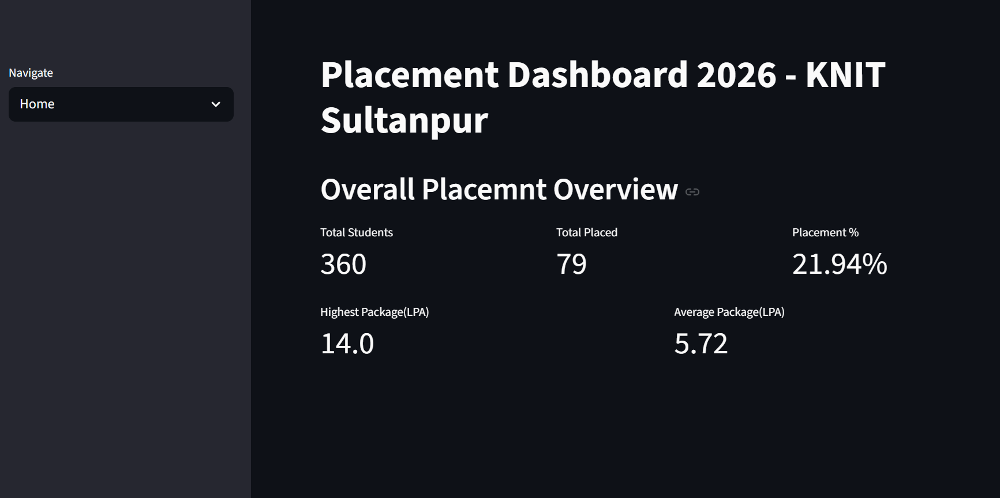
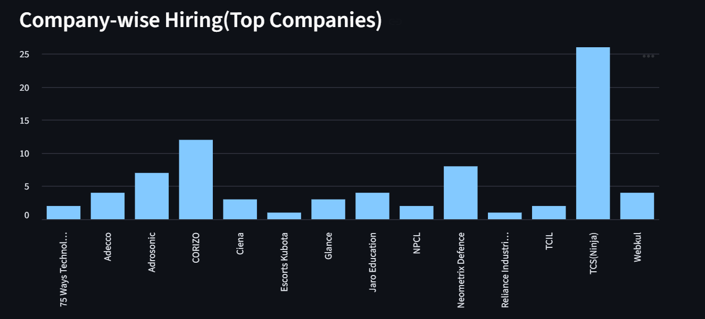
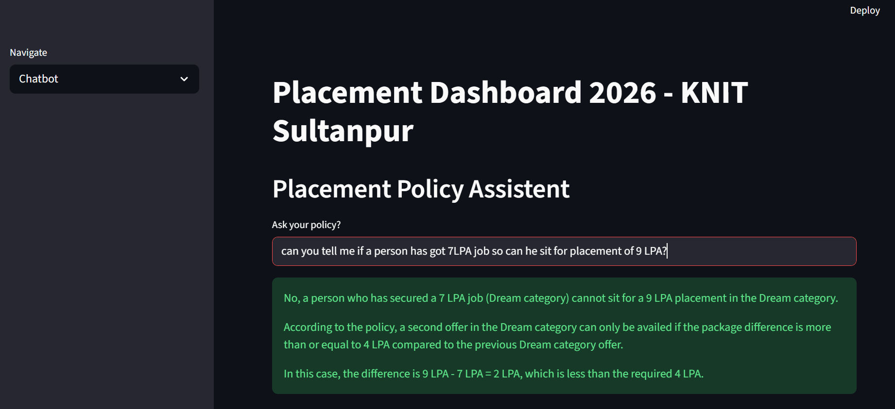

# 📘 Automated Placement Brochure & Dashboard

A full-stack web application that automates placement brochure generation and provides an interactive placement analytics dashboard with a built-in placement policy assistant.

---

## 🚀 Project Overview

The **Automated Placement Brochure System** streamlines the placement process by:

* Automating student data management
* Generating placement brochures dynamically
* Providing real-time placement analytics
* Offering an AI-powered placement policy assistant

This system reduces manual work, improves transparency, and enhances decision-making during campus placements.

---

## ✨ Key Features

### 📊 Placement Dashboard

* Total Students Overview
* Total Placed Students
* Placement Percentage
* Highest & Average Package
* Company-wise Hiring Analytics (Bar Graph)

### 🤖 Placement Policy Assistant

* Interactive chatbot interface
* Normal / Dream policy validation
* Offer eligibility calculation logic
* Package difference comparison system

### 📄 Automated Brochure Generation

* Structured student data storage
* Dynamic brochure generation
* Professional formatting
* Export-ready format

---

## 🏗️ Tech Stack

* Python language
* Streamlit for Deployment and frontend
* Pandas Library
* Numpy Library
* Matplotlib Library


---

## 📸 Screenshots

### 1️⃣ Placement Dashboard Overview



---

### 2️⃣ Company-wise Hiring Analytics



---

### 3️⃣ Placement Policy Assistant (Chatbot)



```

## 👨‍💻 Author

**Himanshu Dubey**

If you found this project helpful, consider giving it a ⭐ on GitHub.
